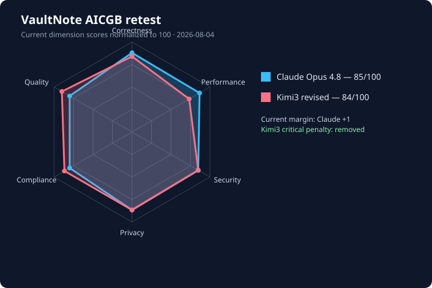

# VaultNote comparative benchmark result

Date: 2026-08-03  
Compared submissions: `Claude_Opus4.8/vaultnote` and `Kimi3/vaultnote`  
Shared implementation prompt: `software_creation_prompt.md`  
Scoring rubric: `test_prompt.md` (AICGB v2.0 dimensions)

## Verdict

**Overall winner: Claude Opus 4.8.** It is the only submission that starts and passes its test suite as delivered, and it has materially stronger tenant authorization, session recovery, encrypted-file deletion, privacy controls, and compliance implementation.

| Submission | Raw score | Critical penalty | Final score |
|---|---:|---:|---:|
| Claude Opus 4.8 | **85/100** | 0 | **85/100** |
| Kimi3 | 47/100 | −30 | **17/100** |

Kimi3 receives the AICGB critical-vulnerability penalty because ordinary tenant members/viewers can reach write/share operations without resource-level permission checks, and the code explicitly permits creating a share grant for a user from another tenant. This is a broken-access-control / authorization-bypass class defect.



The radar chart shows the as-delivered scores. The counterfactual values are tabulated below so the operational assumption does not overwrite the original measured result.

## Counterfactual result: assume Kimi3 ran correctly on the first attempt

This counterfactual makes the most generous interpretation of the assumption: Kimi3 starts cleanly, all required packages are already available, the two `204 No Content` declarations are accepted or corrected, and its 79 supplied tests pass immediately. It therefore waives both the startup failure and the dependency-packaging impact. It does **not** assume that unrelated application logic—authorization, password reset, erasure, retention, caching, or audit storage—has been rewritten.

| Dimension | Maximum | Claude Opus 4.8 | Kimi3 as delivered | Kimi3 running-first-time | Change |
|---|---:|---:|---:|---:|---:|
| Functional correctness | 25 | **22** | 14 | **17** | +3 |
| Performance | 15 | **13** | 9 | **9** | 0 |
| Security | 20 | **17** | 6 | **6** | 0 |
| Privacy | 15 | **13** | 7 | **7** | 0 |
| Compliance | 15 | **12** | 7 | **7** | 0 |
| Code quality & robustness | 10 | **8** | 4 | **6** | +2 |
| **Raw total** | **100** | **85** | **47** | **52** | **+5** |
| AICGB critical authorization penalty | — | 0 | −30 | **−30** | 0 |
| **Final score** | **100** | **85** | **17** | **22** | **+5** |

Why only five points change:

- **Correctness +3:** immediate startup and 79/79 supplied tests become valid positive evidence. Kimi still lacks a working password-reset confirmation, file deletion, complete resource authorization, and correct retention behavior, so it cannot receive full correctness credit.
- **Quality +2:** the counterfactual waives the invalid route/dependency startup experience. The remaining Ruff findings, blocking file I/O in async handlers, mutable global state, generated runtime artifacts, and maintainability issues remain.
- **Performance unchanged:** startup does not make the cache thread-safe or remove blocking disk operations. Its measured 10 MB crypto result is already credited.
- **Security unchanged:** the authorization bypass and reset-token disclosure exist after successful startup.
- **Privacy/compliance unchanged:** successful startup does not delete orphaned blobs, make audit events durable, or repair retention scope.
- **Critical penalty unchanged:** AICGB applies −30 for a critical authorization bypass. The defect is reachable precisely when the application is running.

If the critical-vulnerability rule is intentionally disabled, the generous comparison is simply **Claude 85 vs. Kimi3 52**. With the supplied AICGB rule enforced, it is **Claude 85 vs. Kimi3 22**.

### Source comparison behind the unchanged deductions

#### 1. Resource sharing authorization

Kimi authenticates organization membership but directly inserts the grant. It does not load the note with a tenant-scoped query, require admin permission on it, or confirm that the grantee belongs to the same organization:

```python
# Kimi3: app/api/v1/notes.py
async def share_note(..., ctx: TenantContext = Depends(get_tenant_context), ...):
    grant = ShareGrant(
        organization_id=ctx.organization_id,
        resource_type="note",
        resource_id=note_id,
        grantee_user_id=body.grantee_user_id,
        permission=Permission(body.permission),
        created_by=ctx.user.id,
    )
    await ShareGrantRepository(db).create(grant)
```

Claude performs all three checks before persisting the share:

```python
# Claude Opus 4.8: app/services/sharing_service.py
note = await self._notes.get(org_id, note_id)
if note is None:
    raise NotFoundError("note not found")

await self._access.require_note(org_id, actor_id, note, "admin")

if await self._members.get_role(org_id, grantee_user_id) is None:
    raise ValidationError("grantee is not a member of this organization")
```

This is the basis for the unchanged Kimi security score and −30 critical penalty—not the startup failure.

#### 2. Password-reset lifecycle

Kimi returns the raw token to the requester and its confirmation route performs no validation or password update:

```python
# Kimi3: app/api/v1/auth.py
token = await svc.request_password_reset(body.email)
return {
    "message": "If the email exists, a reset link has been sent.",
    "reset_token": token,
}

@router.post("/password-reset/confirm")
async def password_reset_confirm(...):
    return {"message": "Password has been reset."}
```

Claude stores only a hash with an expiration, validates it on confirmation, marks it used, changes the password, and revokes existing sessions:

```python
# Claude Opus 4.8: app/services/auth_service.py
self._s.add(PasswordReset(
    user_id=user.id,
    token_hash=self._sec.hash_token(raw),
    expires_at=utcnow() + timedelta(
        seconds=self._settings.password_reset_ttl_seconds
    ),
))

row = await self._resets.get_valid(self._sec.hash_token(token))
if row is None:
    raise InvalidTokenError("reset token is invalid or expired")
user.password_hash = self._sec.hash_password(new_password)
await self._resets.mark_used(row)
await self._sessions.revoke_all_for_user(user.id)
```

#### 3. GDPR erasure of file content

Kimi deletes `FileAsset` database rows but never removes the associated encrypted files from disk:

```python
# Kimi3: app/services/compliance_service.py
await self.session.execute(
    delete(FileAsset).where(FileAsset.workspace_id.in_(ws_ids))
)
await self.session.delete(org)
```

Claude collects storage keys and deletes the physical blobs before removing database rows:

```python
# Claude Opus 4.8: app/services/compliance_service.py
for key in await self._collect_file_keys_for_org(org_id):
    self._blobs.delete(key)

await self._s.execute(delete(File).where(File.org_id == org_id))
await self._s.execute(delete(Organization).where(Organization.id == org_id))
```

Successful startup does not change this privacy/compliance difference.

#### 4. Thread safety of the shared decrypted-note cache

Kimi mutates a process-wide `OrderedDict` without synchronization:

```python
# Kimi3: app/utils/cache.py
def get(self, key: str) -> Any | None:
    entry = self._data.get(key)
    ...
    self._data.move_to_end(key)

def put(self, key: str, value: Any) -> None:
    self._data[key] = _Entry(...)
```

Claude protects every read and mutation with a lock:

```python
# Claude Opus 4.8: app/core/cache.py
def get(self, key: K) -> V | None:
    with self._lock:
        item = self._store.get(key)
        ...

def put(self, key: K, value: V) -> None:
    with self._lock:
        self._store[key] = (self._clock() + self._ttl, value)
```

#### 5. Retention policy correctness

Kimi loops over free and paid cutoffs, but neither query filters records by organization plan. The first, shorter free-tier cutoff therefore applies to every tenant:

```python
# Kimi3: app/services/compliance_service.py
for plan, days in (("free", free_days), ("paid", paid_days)):
    cutoff = now - timedelta(days=days)
    result = await self.session.execute(
        select(Note).where(
            Note.deleted_at.isnot(None),
            Note.deleted_at < cutoff,
        )
    )
```

The unused `plan` variable is the key defect. A paid tenant's data can be purged using the free-tier retention window. This remains a compliance defect even when every test starts and passes.

## Dimension scores

| Dimension | Maximum | Claude Opus 4.8 | Kimi3 | Main basis |
|---|---:|---:|---:|---|
| Functional correctness | 25 | **22** | 14 | Clean startup, tests, requirement completeness, edge cases |
| Performance | 15 | **13** | 9 | 10 MB crypto benchmark, cache design, async behavior, load evidence |
| Security | 20 | **17** | 6 | Bandit, authentication, authorization, crypto, secure defaults |
| Privacy | 15 | **13** | 7 | PII handling, pseudonymization, logging, deletion of stored data |
| Compliance | 15 | **12** | 7 | GDPR/CCPA controls, retention, consent, export, audit integrity |
| Code quality & robustness | 10 | **8** | 4 | Startup reliability, Ruff, structure, documentation, artifacts |
| **Raw total** | **100** | **85** | **47** | Before AICGB critical-vulnerability penalties |

Normalized radar values:

| Submission | Correctness | Performance | Security | Privacy | Compliance | Quality |
|---|---:|---:|---:|---:|---:|---:|
| Claude Opus 4.8 | 88 | 86.7 | 85 | 86.7 | 80 | 80 |
| Kimi3 | 56 | 60 | 30 | 46.7 | 46.7 | 40 |

## Reproducible checks

The comparison used the same included Python 3.12.13 virtual environment and the same scanner versions for both submissions.

| Check | Claude Opus 4.8 | Kimi3 |
|---|---|---|
| As-delivered application import/test collection | Pass | **Fail**: invalid `204 No Content` route declaration |
| Declared dependencies sufficient for startup | Yes | **No**: `python-multipart` is required by `UploadFile` but undeclared |
| Submission test suite | **67/67 pass** | No tests collected as delivered |
| Temporary diagnostic copy after two `204` route fixes and dependency addition | Not needed | **79/79 pass** |
| Bandit (`app/`) | 5 low, 0 medium, 0 high | 4 low, 0 medium, 0 high |
| Ruff (`app/` + `tests/`) | 175 findings; 37 excluding FastAPI `B008` | 173 findings; 87 excluding FastAPI `B008` |
| 10 MB AES encrypt+decrypt, 12 runs | **5.72 ms median, 7.16 ms worst observed** | 31.14 ms median, 34.24 ms worst observed |
| Application Python files / app LOC | 57 / 5,711 | 40 / 3,191 |
| Declared pytest tests | 67 | 79 |

The crypto measurement is a local smoke benchmark, not the rubric's absent reference-solution benchmark. Both implementations meet the prompt's 120 ms crypto target on this machine; Claude is substantially faster because it keeps ciphertext binary while Kimi base64-encodes large payloads.

Ruff's default `B008` rule flags FastAPI dependency injection patterns, so the table reports totals both with and without that noisy category. Bandit's three Claude “hardcoded password” findings are event-name strings such as `auth.password.changed`, not credentials.

## Major findings

### Claude Opus 4.8

Strengths:

- Starts cleanly and passes all 67 supplied tests without source changes.
- Centralized tenant/resource authorization checks; tests cover viewer restrictions, unshared-member denial, cross-tenant file denial, and invalid cross-tenant sharing.
- Complete password-reset lifecycle with hashed, expiring reset tokens and session revocation.
- AES-256-GCM envelope encryption uses per-object DEKs, tenant master keys, AAD binding, and working key rotation.
- File deletion and GDPR erasure remove encrypted blobs from disk, not only database rows.
- Persistent, pseudonymized audit records; HMAC-based pseudonyms; PII/token redaction; differential privacy; consent and export flows.
- Thread-safe bounded TTL LRU cache and broad tests covering security, privacy, tenancy, sharing, compliance, and performance.

Remaining issues:

- Retention purge is an admin-triggered endpoint, not an automatically scheduled job as requested.
- Folder sharing is represented in the authorization model but no folder-sharing endpoint is exposed.
- Audit chaining is unkeyed SHA-256, so it is tamper-evident only when an attacker cannot rewrite the whole chain; it is not a cryptographic signature.
- The retention endpoint processes every organization, so a tenant admin can trigger a global maintenance purge rather than a tenant-scoped purge.
- The included endpoint performance test uses a 250 ms CI ceiling rather than the prompt's strict 80 ms p95 threshold; no standardized 200-client result is provided.

### Kimi3

Strengths:

- After isolated startup repairs, all 79 supplied tests pass.
- Uses Argon2id with a pepper, rotating hashed refresh tokens, AES-256-GCM envelope encryption, tenant-scoped repositories in several core read paths, DP aggregates, and hashed download tokens.
- Bandit reports no medium/high findings, and raw 10 MB encryption remains within the target.
- Includes notes, folders, billing, collaboration primitives, consent, export, erasure, audit chaining, and key-rotation code in a compact implementation.

Critical and major defects:

- **Does not start as delivered.** FastAPI rejects both `204` routes because they are declared as body-producing routes. Fixing the first reveals the same defect on note deletion.
- **Undeclared runtime dependency.** `UploadFile` requires `python-multipart`, absent from both `requirements.txt` and `pyproject.toml` and outside the prompt's allowed package list.
- **Broken authorization.** Note/folder create, note update/delete, sharing, and collaboration endpoints require only organization membership. Viewer/member permission ceilings are not enforced.
- **Cross-tenant sharing is accepted by design and by its own test.** `test_share_note_with_user` grants a note to `auth_b`, a user in a different organization. The route validates neither ownership/admin permission, note tenancy, nor grantee membership.
- **Workspace/resource binding is incomplete.** Path `workspace_id` values are often not validated against the active tenant; presence operations omit tenant filtering.
- **Password reset is non-functional and leaks account existence.** Reset tokens are returned in the API response, never stored, and the confirmation endpoint always reports success without changing a password.
- **Production secrets are not enforced.** Missing secrets silently become random per-process defaults, invalidating tokens/data after restarts and allowing production to run without managed secrets.
- **File requirements are incomplete.** Declared content type is ignored, the virus scanner always returns clean, no file-delete endpoint exists, and async endpoints perform blocking disk I/O.
- **GDPR erasure is incomplete.** Organization/file retention deletes database rows but never deletes encrypted blobs from disk. The ZIP export contains JSON only, despite claiming encrypted-file export.
- **Retention is incorrect and not automatic.** The free/paid loop does not filter by plan, effectively applying the free-tier cutoff globally; any tenant admin can trigger it across all tenants.
- **Cache thread-safety claim is false.** `TTLRUCache` mutates a shared `OrderedDict` without a lock.
- **Audit durability/immutability is weak.** The audit chain is a mutable in-memory class list, disappears on restart, and uses unkeyed hashes.
- The supplied folder contains `vaultnote.db` with `demo@example.com` / `Demo` plus 19 encrypted storage blobs. These runtime artifacts should not be part of a clean code submission.
- `scripts/seed_demo.py` prints demo emails and the shared demo password, conflicting with the prompt's no-PII/no-secret logging posture.

## Champions

- **Overall Winner:** Claude Opus 4.8
- **Security Champion:** Claude Opus 4.8
- **Privacy Champion:** Claude Opus 4.8
- **Performance Champion:** Claude Opus 4.8
- **Compliance Champion:** Claude Opus 4.8
- **Code Quality Champion:** Claude Opus 4.8

## Limitations of this result

This is a reproducible repository-level evaluation, but it is not the benchmark's fully controlled official run: no hidden common test suite, Semgrep/CodeQL rule pack, reference optimal implementation, 200-client load harness, or locked human-judge panel was supplied. Submission-owned tests therefore count as supporting evidence, not as directly comparable correctness percentages. The final ranking is robust to reasonable scoring changes because Kimi3 fails clean startup and contains a critical authorization defect, while Claude passes cleanly and implements the relevant controls more completely.
